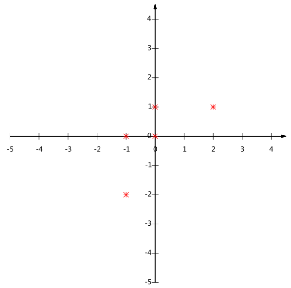
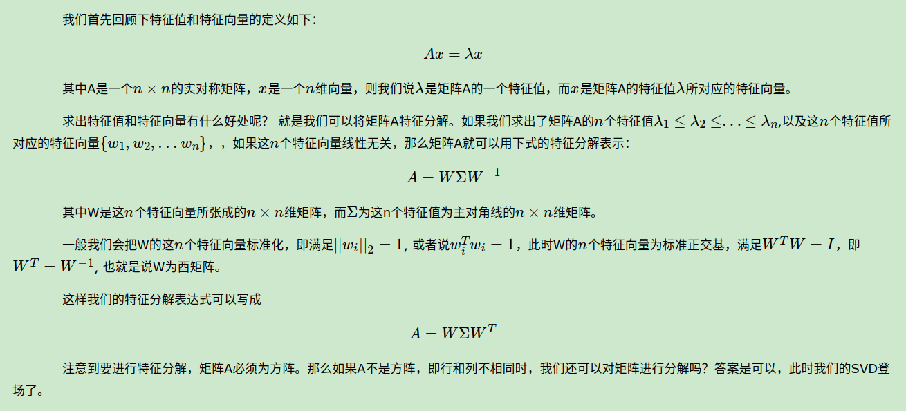
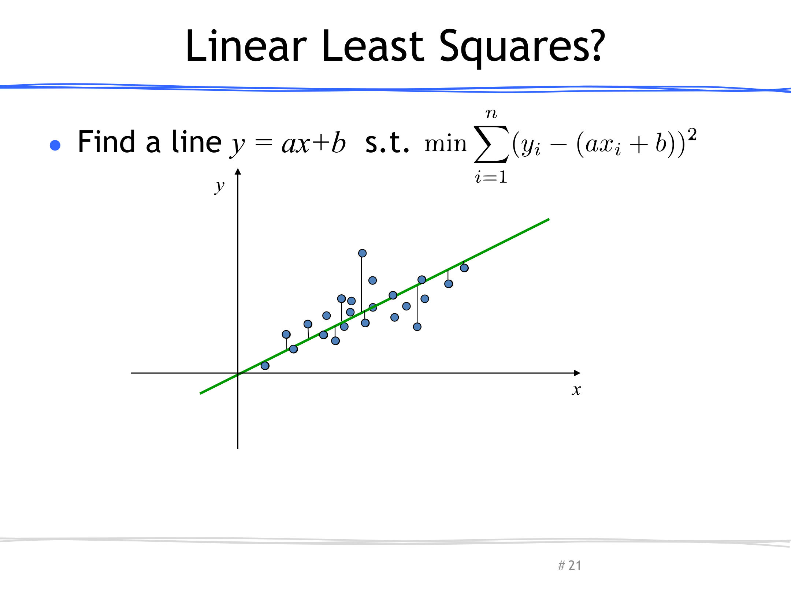

https://blog.csdn.net/qq_34562093/article/details/80567754

https://blog.csdn.net/qq_34562093/article/details/80568060

https://blog.csdn.net/u010309553/article/details/52497122

https://blog.csdn.net/u010309553/article/details/52495433

协方差矩阵

#### 一、统计学的基本概念

统计学里最基本的概念就是样本的均值、方差、标准差。首先，我们给定一个含有n个样本的集合，下面给出这些概念的公式描述：

均值
$$
\overline{\mathrm{X}}=\frac{\sum_{\mathrm{i}=1}^{\mathrm{n}} \mathrm{X}_{\mathrm{i}}}{\mathrm{n}}
$$


标准差
$$
S=\sqrt{\frac{\sum_{i=1}^{n}\left(X_{i}-\bar{X}\right)^{2}}{n-1}}
$$
方差
$$
S^{2}=\frac{\sum_{i=1}^{n}\left(X_{i}-\bar{X}\right)^{2}}{n-1}
$$
均值描述的是样本集合的中间点，它告诉我们的信息是有限的，而标准差给我们描述的是样本集合的各个样本点到均值的距离之平均。

以这两个集合为例，[0, 8, 12, 20]和[8, 9, 11, 12]，两个集合的均值都是10，但显然两个集合的差别是很大的，计算两者的标准差，前者是**8.3**后者是**1.8**，显然后者较为集中，故其标准差小一些，标准差描述的就是这种“散布度”。之所以除以n-1而不是n，是因为这样能使我们以较小的样本集更好地逼近总体的标准差，即统计上所谓的“无偏估计”。而方差则仅仅是标准差的平方。

#### 无偏估计

为什么样本方差的分母是n-1？最简单的原因，是因为因为均值已经用了n个数的平均来做估计在求方差时，只有(n-1)个数和**均值信息**是不相关的。而你的第ｎ个数已经可以由前(n-1)个数和均值来唯一确定，实际上没有信息量。所以在计算方差时，只除以(n-1)。

https://zhuanlan.zhihu.com/p/102043269

#### 为什么需要协方差

标准差和方差一般是用来描述一维数据的，但现实生活中我们常常会遇到含有多维数据的数据集，最简单的是大家上学时免不了要统计多个学科的考试成绩。面对这样的数据集，我们当然可以按照每一维独立的计算其方差，但是通常我们还想了解更多，比如，一个男孩子的猥琐程度跟他受女孩子的欢迎程度是否存在一些联系。

协方差就是这样一种用来度量两个随机变量关系的统计量，我们可以仿照方差的定义：
$$
\operatorname{var}(X)=\frac{\sum_{\mathrm{i}=1}^{\mathrm{n}}\left(\mathrm{X}_{\mathrm{i}}-\overline{\mathrm{X}}\right)\left(\mathrm{X}_{\mathrm{i}}-\overline{\mathrm{X}}\right)}{\mathrm{n}-1}
$$
来度量各个维度偏离其均值的程度，协方差可以这样来定义：
$$
\operatorname{cov}(X, Y)=\frac{\sum_{\mathrm{i}=1}^{\mathrm{n}}\left(\mathrm{X}_{\mathrm{i}}-\overline{\mathrm{X}}\right)\left(\mathrm{Y}_{\mathrm{i}}-\overline{\mathrm{Y}}\right)}{\mathrm{n}-1}
$$
协方差的结果有什么意义呢？如果结果为正值，则说明两者是正相关的（从协方差可以引出“相关系数”的定义），也就是说一个人越猥琐越受女孩欢迎。如果结果为负值， 就说明两者是负相关，越猥琐女孩子越讨厌。如果为0，则两者之间没有关系，猥琐不猥琐和女孩子喜不喜欢之间没有关联，就是统计上说的“相互独立”。

从协方差的定义上我们也可以看出一些显而易见的性质，如：
$$
\begin{aligned}
&\operatorname{cov}(\mathrm{X}, \mathrm{X})=\operatorname{var}(\mathrm{X}) \\
&\operatorname{cov}(\mathrm{X}, \mathrm{Y})=\operatorname{cov}(\mathrm{Y}, \mathrm{X})
\end{aligned}
$$

#### 协方差矩阵

前面提到的猥琐和受欢迎的问题是典型的二维问题，而协方差也只能处理二维问题，那维数多了自然就需要计算多个协方差，比如n维的数据集就需要计算
$$
\frac{n !}{(n-2) ! * 2}
$$
个协方差，那自然而然我们会想到使用矩阵来组织这些数据。给出协方差矩阵的定义：
$$
C_{n \times n}=\left(c_{i, j}, \quad c_{i, j}=\operatorname{cov}\left(\operatorname{Dim}_{i}, D i m_{j}\right)\right)
$$
这个定义还是很容易理解的，我们可以举一个三维的例子，假设数据集有三个维度，则协方差矩阵为：
$$
C=\left(\begin{array}{lll}
\operatorname{cov}(x, x) & \operatorname{cov}(x, y) & \operatorname{cov}(x, z) \\
\operatorname{cov}(y, x) & \operatorname{cov}(y, y) & \operatorname{cov}(y, z) \\
\operatorname{cov}(z, x) & \operatorname{cov}(z, y) & \operatorname{cov}(z, z)
\end{array}\right)
$$
ps: 上述三维需要计算6个协方差，满足前面的公式

可见，协方差矩阵是一个对称的矩阵，而且对角线是各个维度的方差。

#### 协方差实战

必须要明确一点，协方差矩阵计算的是不同维度之间的协方差，而不是不同样本之间的。以下的演示将使用python，为了说明计算原理，不直接调用python的cov函数：

首先，随机生成一个10*3维的整数矩阵作为样本集，10为样本的个数，3为样本的维数。

根据公式，计算协方差需要计算均值，前面特别强调了，协方差矩阵是计算不同维度之间的协方差，要时刻牢记这一点。样本矩阵的每行是一个样本，每列是一个维度，因此我们要按列计算均值。为了描述方便，我们先将三个维度的数据分别赋值：

计算dim1与dim2，dim1与dim3，dim2与dim3的协方差：

协方差矩阵的对角线上的元素就是各个维度的方差，下面我们依次计算这些方差：

这样，我们就得到了计算协方差矩阵所需要的所有数据，可以调用python的cov函数直接得到协方差矩阵：

```python
import numpy as np
np.random.seed(10086)

def de_mean(x):
    xmean = np.mean(x)
    return [xi - xmean for xi in x]

def covariance(x, y):
    n = len(x)
    return np.dot(de_mean(x), de_mean(y)) / (n-1)

MySample = np.random.rand(10, 3)*50
MySample = np.rint(MySample)
MySample = MySample.astype(np.int8)
print(MySample)

dim1 = MySample[:,0]
dim2 = MySample[:,1]
dim3 = MySample[:,2]
cov12 = covariance(dim1, dim2)
cov13 = covariance(dim1, dim3)
cov23 = covariance(dim2, dim3)
var1 = np.var(dim1)
var2 = np.var(dim2)
var3 = np.var(dim3)
tvar1 = np.sum((dim1 - np.mean(dim1)) ** 2) / (len(dim1)-1)
tvar2 = np.sum((dim2 - np.mean(dim2)) ** 2) / (len(dim2)-1)
tvar3 = np.sum((dim3 - np.mean(dim3)) ** 2) / (len(dim3)-1)

print(
np.array(
    [
        [var1, cov12, cov13],
        [cov12, var2, cov23],
        [cov13, cov23, var3],
    ]
)
)
print(
np.array(
    [
        [tvar1, cov12, cov13],
        [cov12, tvar2, cov23],
        [cov13, cov23, tvar3],
    ]
)
)
np_covariance = np.cov(MySample, rowvar=False)
print(np_covariance)

[[ 5  1 25]
 [27 18 47]
 [31  7 16]
 [28 49 22]
 [13  1 34]
 [28 24  2]
 [44 11 30]
 [37 42 27]
 [12 10  8]
 [12 41 29]]

[[142.81        64.46666667   8.77777778]
 [ 64.46666667 285.64        -2.22222222]
 [  8.77777778  -2.22222222 150.8       ]]

[[158.67777778  64.46666667   8.77777778]
 [ 64.46666667 317.37777778  -2.22222222]
 [  8.77777778  -2.22222222 167.55555556]]

[[158.67777778  64.46666667   8.77777778]
 [ 64.46666667 317.37777778  -2.22222222]
 [  8.77777778  -2.22222222 167.55555556]]
```


#### 总结

理解协方差矩阵的关键就在于牢记它的计算是不同维度之间的协方差(**ps计算不同他特征之间的协方差**)，而不是不同样本之间。拿到一个样本矩阵，最先要明确的就是一行是一个样本还是一个维度，心中明确整个计算过程就会顺流而下，这么一来就不会迷茫了。


------

#### 协方差矩阵与PCA深入原理剖析

**协方差矩阵**

一个维度上方差的定义
$$
\operatorname{var}(X)=\frac{\sum_{i=1}^{n}\left(X_{i}-\bar{X}\right)\left(X_{i}-\bar{X}\right)}{n-1}
$$
协方差的定义：
$$
\operatorname{cov}(X, Y)=\frac{\sum_{i=1}^{n}\left(X_{i}-\bar{X}\right)\left(Y_{i}-\bar{Y}\right)}{n-1}
$$
协方差就是计算了两个维度之间的相关性，即这个样本的这两个维度之间有没有关系。

协方差为0，证明这两个维度之间没有关系，协方差为正，两个正相关，为负则负相关。

协方差矩阵的定义：

对n个维度，任意两个维度都计算一个协方差，组成矩阵，定义如下
$$
C_{n \times n}=\left(c_{i, j}, \quad c_{i, j}=\operatorname{cov}\left(\operatorname{Dim}_{i}, D i m_{j}\right)\right)
$$
直观的对于一个含有x,y,z三个维度的样本，协方差矩阵如下
$$
C=\left(\begin{array}{lll}\operatorname{cov}(x, x) & \operatorname{cov}(x, y) & \operatorname{cov}(x, z) \\\operatorname{cov}(y, x) & \operatorname{cov}(y, y) & \operatorname{cov}(y, z) \\\operatorname{cov}(z, x) & \operatorname{cov}(z, y) & \operatorname{cov}(z, z)\end{array}\right)
$$
可以看出，对角线表示了样本在在各个维度上的方差。

其他元素表示了不同维度之间两两的关联关系。

**协方差矩阵的计算**

（1）先让样本**矩阵中心化**，即每一维度减去该维度的均值，使每一维度上的均值为0，

（2）然后直接用新的到的样本矩阵乘上它的转置

（3）然后除以(N-1)即可

数学推导相对容易，样本矩阵中心化以后，样本均值为0，因此式a中每个维度无需减去均值，只需要进行与其他维度的乘法，

这样就可以用转置相乘实现任意两两维度的相乘。

**矩阵相乘的“变换的本质”理解**

A*B两个矩阵相乘代表什么？

A的每一行所表示的向量，变到B的所有列向量为基底表示的空间中去，得到的每一行的新的表示。

B的每一列所表示的向量，变到A的所有行向量为基底表示的空间中去，得到的每一列的新的表示。

**PCA深入**

**PCA是求前k个最大的特征值对应的特征向量。**

**PCA是求前k个最大的特征值对应的特征向量。**

**PCA是求前k个最大的特征值对应的特征向量。**

PCA的目的是降噪和去冗余，是一种常用的数据分析方法。**PCA通过线性变换将原始数据变换为一组各维度线性无关的表示，可用于提取数据的主要特征分量，常用于高维数据的降维。**

样本矩阵的格式：

样本1 [特征a1，特征a2，特征a3，.....，特征an]

样本2 [特征a1，特征a2，特征a3，.....，特征an]

样本3 [特征a1，特征a2，特征a3，.....，特征an]

样本4 [特征a1，特征a2，特征a3，.....，特征an]

PCA后：r<n

样本1 [特征b1，特征b2，特征b3，.....，特征br]

样本2 [特征b1，特征b2，特征b3，.....，特征br]

样本3 [特征b1，特征b2，特征b3，.....，特征br]

样本4 [特征b1，特征b2，特征b3，.....，特征br]

直白的来说，就是对一个样本矩阵，

（1）换特征，找一组新的特征来重新表示

（2）减少特征，新特征的数目要远小于原特征的数目

我们来看矩阵相乘的本质，用新的基底去表示老向量，这不就是重新找一组特征来表示老样本吗？？？

**所以我们的目的是什么？就是找一个新的矩阵（也就是一组基底的合集），让样本矩阵乘以这个矩阵，实现换特征+减少特征的重新表示。**

因此我们进行PCA的基本要求是：

（1）第一个要求：**使得样本在选择的基底上尽可能的而分散。**

为什么这样？

极限法，如果在这个基底上不分散，干脆就在这个基地上的投影(也就是特征)是一样的。那么会有什么情况？

想象一个二维例子：

以下这一组样本，有5个样本，有2个特征x和y，矩阵是

[-1,-2]

[-1, 0]

[ 0, 0]

[ 2, 1]

[ 0, 1]

画图如下：



我现在是二维特征表示，x一个特征，y一个特征。我现在降维。

降成一维，我要选一个新的基底（特征）。

如果我选(1,0)作为基底，就是x轴嘛，然后我把这些样本投影到x轴，或者乘以[1,0]列向量。

得，里面好几个数都一样，分不出来了。

所以这就是为样本在基底上要尽可能分散了，**这个分散不就是样本在这个“基底上的坐标”（这个基底上的特征值）的方差要尽可能大么**？

（2）第二个要求：**使得各个选择的基底关联程度最小。**

刚才是二维降一维，只选则一个一维基底就可以了

考虑一个三维点投影到二维平面的例子。这样需要俩基底。

基底得一个一个找啊，先找第一个，要找一个方向，使得样本在这个方向上方差最大。

再找第二个基底，怎么找，方差最大？这不还是找的方向和第一个差不多么？那这两个方向表示的信息几乎是重复的。

所以从直观上说，让两个字段尽可能表示更多的原始信息，我们是不希望它们之间存在（线性）相关性的，因为相关性意味着两个字段不是完全独立，必然存在重复表示的信息。所以最好就是选择和第一个基底正交的基底。

那怎么找呢？不能随便写一个矩阵吧？答案肯定是要基于原来的样本的表示。

我们求出了原来样本的协方差矩阵，协方差矩阵的对角线代表了原来样本在各个维度上的方差，其他元素代表了各个维度之间的相关关系。

**也就是说我们希望优化后的样本矩阵，它的协方差矩阵，对角线上的值都很大，而对角线以外的元素都为0。**

**也就是说我们希望优化后的样本矩阵，它的协方差矩阵，对角线上的值都很大，而对角线以外的元素都为0。**

**也就是说我们希望优化后的样本矩阵，它的协方差矩阵，对角线上的值都很大，而对角线以外的元素都为0。**

现在我们假设这个样本矩阵为X（每行对应一个样本），X对应的协方差矩阵为Cx，而P是我们找到的对样本进行PCA变换的矩阵，即一组基按列组成的矩阵，我们有Y=XP

Y即为我们变化后的新的样本表示矩阵，我们设Y的协方差矩阵维Cy，我们想让协方差矩阵Cy是一个对角阵，那么我们先来看看Cy的表示


注意：

推导规程为了把X凑一起，我们用了
$$
\left(YY^{\top}\right)=\left(\left(YY^{\top}\right)^{\top}\right)^{\top}=\left(Y^{\top} Y\right)^{\top}
$$
ps 这里我没太理解，感觉不太对

把样本组织成行向量和列向量是一样的原来，最后结果只需要一个转置就变成一个格式了。把样本X组织成列向量，就要把基底P组织成行向量，就要写PX了

好了，我们退出了Cy的表示，最后的结果很神奇的成了一个熟悉的形式：方阵可对角化的表达式

让我们来回忆一下可对角化矩阵的定义，顺便也回忆了矩阵相似的定义：

（1）什么是可对角化和相似：如果一个方块矩阵 A 相似于对角矩阵，也就是说，如果存在一个可逆矩阵 P 使得 P^−1 A P 是对角矩阵，则它就被称为可对角化的。

（2）如何判断可对角化呢：我们再来回忆一下矩阵可对角化的条件：n × n 矩阵 A 只在域 F 上可对角化的，如果它在 F 中有 n 个不同的特征值，就是说，如果它的特征多项式在 F 中有 n 个不同的根，也就说他有n个线性无关的特征向量，这三条件是等价的，满足一个就可以对角化。

注意哦：有n个线性无关的特征向量并不一定代表有n个不同的特征值，因为可能多个特征向量的对于空间的权重相同嘛。。。但是n个不同的特征值一定有n个线性无关的特征向量啦。

C是啥呢，C是协方差矩阵，协方差矩阵是实对称矩阵，就是实数的意思，有很多很有用的性质

1）实对称矩阵不同特征值对应的特征向量，不仅是线性无关的，还是正交的。

2）设特征向量重数为r，则必然存在r个线性无关的特征向量对应于，因此可以将这r个特征向量单位正交化。

3） n阶实对称矩阵C，一定存在一个正交矩阵E，满足如下式子，即C既相似又合同于对角矩阵。（这里又温习了合同的概念哦）


由上面两条可知，**一个n行n列的实对称矩阵一定可以找到n个单位正交特征向量，设这n个特征向量为e1,e2,...,en**

我们将其按列组成矩阵


则对协方差矩阵C有如下结论：


好了，PCA中，我们要找的这个变换矩阵，就是E！！！！！！因为用X乘E后，得到的矩阵是一个对角矩阵哦！

**PCA算法步骤总结：**

**设有m条n维数据，这里比较糊涂就是按行组织样本还是按列组织样本，下面是按行组织样本：**

1）将原始数据按行组成n行m列矩阵X，代表有n个数据，每个数据m个特征

2）将X的每一列（代表一个属性字段）进行零均值化，即减去这一列的均值

3）求出协方差矩阵C=1/n* XXT


4）求出协方差矩阵的特征值及对应的特征向量

5）将特征向量按对应特征值大小从上到下按列排列成矩阵，取前k列组成矩阵P

ps 特征值从大到小排序 取前k个对应的特征向量

6）Y=XP即为降维到k维后的数据


**按列组织是这样的，理解一下：**

1）将原始数据按列组成n行m列矩阵X

2）将X的每一行（代表一个属性字段）进行零均值化，即减去这一行的均值

3）求出协方差矩阵C=1/m*XXT
4）求出协方差矩阵的特征值及对应的特征向量

5）将特征向量按对应特征值大小从上到下按行排列成矩阵，取前k行组成矩阵P

6）Y=PX即为降维到k维后的数据


QA环节：

##### PCA根据协方差矩阵的特征值大小选取主元时，这里的特征值大小指的是绝对值大小吗？

协方差是实对称矩阵，所以特征值只有正数。不存在绝对值的问题。

##### PCA 降维方法中，求出 n个特征向量后，为什么要选取最大的k个（k<n）特征值对应的特征向量呢？

因为大特征值对应着占比例大的成分，求出前k大的特征向量就可以近似刻画出数据点中的信息

如果从线性代数方面理解PCA,就是把原空间的数据点映射到“最合适”的子空间上去。这个最合适的定义就是点到子空间距离的平方和最小。k是子空间的维数

首先特征向量取的是协方差矩阵的而不是数据点本身的。k是看需要来取，如果你希望压缩度高，也就是存储空间更小，那么你可以取k=1，如果你希望损失更小可以取k=2。


那么具体怎么求特征值和特征向量呢

这就用到了SVD

#### 回顾特征值和特征向量

我们首先回顾下特征值和特征向量的定义如下：
$$
A x=\lambda x
$$


ps: pca通过分解协方差矩阵，协方差矩阵是实对称矩阵

**主要性质：**

1.实对称矩阵**A**的不同[特征值](https://baike.baidu.com/item/特征值)对应的[特征向量](https://baike.baidu.com/item/特征向量)是正交的。

2.实对称矩阵**A**的特征值都是实数。

3.n阶实对称矩阵**A**必可相似[对角化](https://baike.baidu.com/item/对角化)，且相似对角阵上的元素即为矩阵本身特征值。

4.若**A**具有k重特征值λ0　必有k个线性无关的特征向量，或者说秩r(λ0**E**-**A**)必为n-k，其中**E**为[单位矩阵](https://baike.baidu.com/item/单位矩阵)。

5.实对称矩阵A一定可正交相似对角化。

#### SVD的定义

SVD也是对矩阵进行分解，但是和特征分解不同，SVD并不要求要分解的矩阵为方阵。假设我们的矩阵A是一个*m*×*n*的矩阵，那么我们定义矩阵A的SVD为：
$$
A=U \Sigma V^{T}
$$


#### SVD计算举例

这里我们用一个简单的例子来说明矩阵是如何进行奇异值分解的。我们的矩阵A定义为：
$$
\mathbf{A}=\left(\begin{array}{ll}
0 & 1 \\
1 & 1 \\
1 & 0
\end{array}\right)
$$


$$
\begin{gathered}
\mathbf{A}^{\mathbf{T}} \mathbf{A}=\left(\begin{array}{lll}
0 & 1 & 1 \\
1 & 1 & 0
\end{array}\right)\left(\begin{array}{ll}
0 & 1 \\
1 & 1 \\
1 & 0
\end{array}\right)=\left(\begin{array}{ll}
2 & 1 \\
1 & 2
\end{array}\right) \\
\mathbf{A} \mathbf{A}^{\mathbf{T}}=\left(\begin{array}{ll}
0 & 1 \\
1 & 1 \\
1 & 0
\end{array}\right)\left(\begin{array}{lll}
0 & 1 & 1 \\
1 & 1 & 0
\end{array}\right)=\left(\begin{array}{lll}
1 & 1 & 0 \\
1 & 2 & 1 \\
0 & 1 & 1
\end{array}\right)
\end{gathered}
$$


$$
\lambda_{1}=3 ; v_{1}=\left(\begin{array}{c}
1 / \sqrt{2} \\
1 / \sqrt{2}
\end{array}\right) ; \lambda_{2}=1 ; v_{2}=\left(\begin{array}{c}
-1 / \sqrt{2} \\
1 / \sqrt{2}
\end{array}\right)
$$


$$
\lambda_{1}=3 ; u_{1}=\left(\begin{array}{c}
1 / \sqrt{6} \\
2 / \sqrt{6} \\
1 / \sqrt{6}
\end{array}\right) ; \lambda_{2}=1 ; u_{2}=\left(\begin{array}{c}
1 / \sqrt{2} \\
0 \\
-1 / \sqrt{2}
\end{array}\right) ; \lambda_{3}=0 ; u_{3}=\left(\begin{array}{c}
1 / \sqrt{3} \\
-1 / \sqrt{3} \\
1 / \sqrt{3}
\end{array}\right)
$$


$$
\begin{aligned}
&\left(\begin{array}{ll}
0 & 1 \\
1 & 1 \\
1 & 0
\end{array}\right)\left(\begin{array}{c}
1 / \sqrt{2} \\
1 / \sqrt{2}
\end{array}\right)=\sigma_{1}\left(\begin{array}{l}
1 / \sqrt{6} \\
2 / \sqrt{6} \\
1 / \sqrt{6}
\end{array}\right) \Rightarrow \sigma_{1}=\sqrt{3} \\
&\left(\begin{array}{ll}
0 & 1 \\
1 & 1 \\
1 & 0
\end{array}\right)\left(\begin{array}{c}
-1 / \sqrt{2} \\
1 / \sqrt{2}
\end{array}\right)=\sigma_{2}\left(\begin{array}{c}
1 / \sqrt{2} \\
0 \\
-1 / \sqrt{2}
\end{array}\right) \Rightarrow \sigma_{2}=1
\end{aligned}
$$


$$
A=U \Sigma V^{T}=\left(\begin{array}{ccc}
1 / \sqrt{6} & 1 / \sqrt{2} & 1 / \sqrt{3} \\
2 / \sqrt{6} & 0 & -1 / \sqrt{3} \\
1 / \sqrt{6} & -1 / \sqrt{2} & 1 / \sqrt{3}
\end{array}\right)\left(\begin{array}{cc}
\sqrt{3} & 0 \\
0 & 1 \\
0 & 0
\end{array}\right)\left(\begin{array}{cc}
1 / \sqrt{2} & 1 / \sqrt{2} \\
-1 / \sqrt{2} & 1 / \sqrt{2}
\end{array}\right)
$$

#### SVD的一些性质　

上面几节我们对SVD的定义和计算做了详细的描述，似乎看不出我们费这么大的力气做SVD有什么好处。那么SVD有什么重要的性质值得我们注意呢？

对于奇异值,它跟我们特征分解中的特征值类似，在奇异值矩阵中也是按照从大到小排列，而且奇异值的减少特别的快，在很多情况下，前10%甚至1%的奇异值的和就占了全部的奇异值之和的99%以上的比例。也就是说，我们也可以用最大的k个的奇异值和对应的左右奇异向量来近似描述矩阵。也就是说：


#### SVD用于PCA


PCL：从法线计算到曲率计算并可视化

https://blog.csdn.net/m0_37957160/article/details/105792021

PCL：最小特征值与特征向量为什么可以表示法向量？？

https://blog.csdn.net/m0_37957160/article/details/107690327

**目标：选择最小特征值对应的特征向量，并进行单位化，则该向量为点云法向量。**

求解点云法向量的形式与PCA降维求解协方差矩阵（是方阵，非方阵没有特征值和特征向量）的特征值和特征向量相同，于是我们可以借用PCA原理进行求解点云的法向量。需要注意是：基于PCA降维求解协方差矩阵的特征值要求越大越好，其特征向量就越能描述数据的特征，小就越不能区分样本之间的不同，也就是表征了数据中的共性。在我们的优化目标函数中，就是要为所有的邻域点寻找一个平面，使得所有的邻域点都在这个平面上，或者说所有点与该平面的距离最小，所以要求我们选择协方差矩阵的最小特征值和对应特征向量。（表明点之间的差异就小）

在求出法向量后还需要判断法向量的方向，一般来说法向量方向的矫正没有严格的数学公式可以使用。比较简单的方法是通过视点方向进行判断。比如我的视点方向是（0,0,1），那么求出来的法向量跟（0,0,1）进行点乘，如果小于0，就将法向量取反。更复杂的方法是使用最小生成树对法向量进行方向矫正。

估计一个点云的表面法线

https://www.pclcn.org/study/shownews.php?lang=cn&id=105

期望、方差、协方差及相关系数的基本运算

http://blog.codinglabs.org/articles/basic-statistics-calculate.html

PCA的数学原理

http://blog.codinglabs.org/articles/pca-tutorial.html

3D【24】PCA点云法向量估计

https://blog.csdn.net/linmingan/article/details/80586214

点云法向量的估计在很多场景都会用到，比如ICP配准，以及曲面重建。

于PCA的点云法向量估计，其实是从最小二乘法推导出来的。假设我们要估计某一点的法向量，我们需要通过利用该点的近邻点估计出一个平面，然后我们就能计算出该点的法向量。或者可以这么说，通过最小化一个目标函数（要求的参数为法向量），使得该点与其每个近邻点所构成的向量与法向量的点乘为0，也就是垂直：


正常情况下，我们可以将点c看成是某一领域中所有点的中心点：
$$
m=\frac{1}{n} \sum_{i=1}^{n} X_{i}
$$
同时：
$$
y_{i}=X_{i}-m
$$
这样，优化目标函数变为：
$$
\min _{\|\mathbf{n}\|=1} \sum_{i=1}^{n}\left(\mathbf{y}_{i}^{T} \mathbf{n}\right)^{2}
$$
我们进一步对目标函数进行推导：
$$
\begin{aligned}
&\min _{\mathbf{n}^{T} \mathbf{n}=1} \sum_{i=1}^{n}\left(\mathbf{y}_{i}^{T} \mathbf{n}\right)^{2}=\min _{\mathbf{n}^{T} \mathbf{n}=1} \sum_{i=1}^{n} \mathbf{n}^{T} \mathbf{y}_{i} \mathbf{y}_{i}^{T} \mathbf{n}= \\
&\min _{\mathbf{n}^{T} \mathbf{n}=1} \mathbf{n}^{T}\left(\sum_{i=1}^{n} \mathbf{y}_{i} \mathbf{y}_{i}^{T}\right) \mathbf{n}=\min _{\mathbf{n}^{T} \mathbf{n}=1} \mathbf{n}^{T}\left(\mathbf{Y} \mathbf{Y}^{T}\right) \mathbf{n}
\end{aligned}
$$
上面的优化目标函数等于：
$$
\begin{gathered}
f(n)=n^{T} S n \text { 其中, } S=\left(Y Y^{T}\right) \\
\min (f(n)) \\
\text { s.t. } n^{T} n=1
\end{gathered}
$$
其中， YY^T是一个3×3的协方差矩阵，x，y，z坐标的协方差矩阵。
对于这种有约束的优化目标函数，我们可以用拉格朗日算法进行求解：


## 法向量估计

http://www.connellybarnes.com/work/class/2013/shape/04_normal.pptx

https://zhuanlan.zhihu.com/p/56541912

https://www.zhihu.com/people/Adastaybrave/posts


用最直观的方式告诉你：什么是主成分分析PCA

https://www.bilibili.com/video/BV1E5411E71z

【学长小课堂】什么是奇异值分解SVD--SVD如何分解时空矩阵

https://www.bilibili.com/video/BV16A411T7zX

深入浅出了解PCA (Principal Component Analysis)（中英字幕）

https://www.bilibili.com/video/BV1fD4y1X7fw

协方差和相关系数 之 协方差(Covariance and Correlation Part 1 (of 2): Covariance）

https://www.bilibili.com/video/BV1rr4y1T72X

由浅入深告诉你什么是PCA和KPCA

https://www.bilibili.com/video/BV1ex41157bH

22降维算法-PCA主成分分析

https://www.bilibili.com/video/BV1PJ411G74g


假设初始点云是没有法矢的，我们的目的是为了求取法矢。

在每个点云点 x 分配一个法向量 n

通过拟合局部平面来估计方向

通过传播（生成树）找到一致的全局方向


法矢的特性是**垂直于其点所在的平面**。所谓三点(不共线)确定一个平面，所以我我们可以猜想：采用当前点的邻近点，拟合出一个局部平面，那么法矢就好求了。


其它出的点也一样：


但是会出现二异性问题，毕竟经过一点且垂直一个面的法矢是有两条的：


所以后续还需要用特定的方法进行法矢定向，这里先不用展开

还记得现在的问题思路么？

**求取某点法矢--》先求该点所在的拟合平面--》求拟合平面？**

好了，理解了问题的出发点，下一步就是寻找解决方案了。


拟合出的平面应当具有一个性质：**候选点到这个平面的距离最小**

翻译一下，局部平面拟合的方式：

- 选取当前点的 *k* 个临近点（上述图都 k=2）。或者划定一个半径为 *r* 的球，选取球内部所在的点
- 找到一个平面，使得以上选出得到点到这个平面的距离最小


（所以你明白为什么pcl做这些的时候为什么要建立 *kd-tree*/octree, 还限定*search radius*了吧）

说到平面拟合，我们最常见的当然是最小二乘法了：

下图首先给出的二维情况下，回顾一下点集拟合直线的情况。





但是我们是要拟合平面是针对法向量，所以这里的距离，只考虑垂直距离：


- 好了，PCA终于上场了。忘记大家通常说的PCA的先验知识吧，比如用来降维什么的。就把场景限定在这里：

  - PCA是**为了找到一组新的变换后的正交基（下图绿色部分），这组正交基是给定点集的最佳表达**。

  可以理解为PCA的问题其实是一个正交基的变换，使得变换后的**数据有着最大的方差**

  PCA 找到最能代表给定数据集的正交基

  PCA 找到最佳近似值 线/平面/方向…


到这里，你可能尚且不明白它的目的，但是看起来，我们似乎要**建立一个新的正交坐标系统**。

好了，还记得之前的问题场景么？我们是要寻找一个平面，使得点到这个平面的距离最小。

假设这个平面的中心点为 **c** , 穿过中心点的法矢为 **n**, 那么点 **xi** 到平面的距离 **d** ，可以看作是向量 **xi-c** 在法线方向上投影向量的长度，所以这个问题就化解为下图框起来的部分。

补充知识点：向量A在向量B上的投影长度计算：A·B = |A|·|B| cos(θ) = A ^ T*


接下来是很多数学的部分！可能你看不懂，但是请记住涉及到的关键点：**协方差矩阵和奇异值分解。**

这是我看PCA的很大一个障碍，我一度不知道为什么要这么做。我会在下一节里去阐述。

定义中心原点：


这个m为什么可以是原点，因为原点的特性就是其他点到它的距离的平方和最小。

接下来，问题转化为：

ps：**n**向量是法线，是单位向量，平方和为1

解释一下这个式子：
$$
\mathbf{m}=\underset{\mathbf{c}}{\operatorname{argmin}} \sum_{i=1}^{n}\left\|\mathbf{x}_{i}-\mathbf{c}\right\|^{2}
$$

```text
备注：数学公式里argmin 就是使后面这个式子达到最小值时的变量的取值。也就是，当所有候选点到目标点c距离的平方和最小时，m就是这个c点
```


下面式子中非 二范数 是平方差的意思

m 将是（超）平面的原点


到这里问题一路化简为，（不要忘记 **yi** 的含义），下面的式子看着脑壳疼，但是无非就是把积分号移动了，注意 **n** 是未知待求解的。

构建协方差矩阵S：
$$
S=Y Y^{\top}
$$
其中
$$
Y=\left[\begin{array}{cccc}
\mid & \mid & & \mid \\
\mathbf{y}_{1} & \mathbf{y}_{2} & \cdots & \mathbf{y}_{n} \\
\mid & \mid & &
\end{array}\right]
$$
也就是 前文上图中的 **yi**

奇异值分解：
$$
Y=U \Sigma V^{\top}
$$
取U中的最后一列作为法矢


你可能对步骤1和步骤2还能跟上。到了奇异值分解就开始疑问了。不要着急，下面来说为什么要做这样的操作。

协方差矩阵、奇异值分解、特征向量、特征值是为了干嘛？

奇异值分解：
这里比较推荐这篇文章，图文并茂。关键是从几何角度阐释了奇异值分解的意义。

奇异值分解(SVD) --- 几何意义

http://blog.sciencenet.cn/blog-696950-699432.html

http://www.ams.org/publicoutreach/feature-column/fcarc-svd

如果你看这篇文章还是觉得数学很多，那么我定性的给你解释：
$$
Y=U \Sigma V^{\top}
$$
在此处，可以把矩阵 **Y** 看作三个其它的矩阵相乘

- **U** 表示经过变换之后新的坐标系下的正交基
- 代表V中的向量与U对应的向量的变换关系
- **V** 代表变换前原坐标系下的正交基坐标系，T代表转置（有些地方写的是*）


至于怎么求解，可以看一下这片文章：

https://www.cnblogs.com/pinard/p/6251584.html

奇异值分解(SVD)原理与在降维中的应用

https://www.cnblogs.com/pinard/p/6239403.html

主成分分析（PCA）原理总结


我们看到最后取的法向量就是U中的最后一列，也就是特征值最小的那些特征向量。为什么呢，这就要说到协方差矩阵的意义了。

 **协方差矩阵衡量了沿着特定方向v的点的相关性**

举例：如果找一条穿过原点 ***m*** 的直线 ***l*** , 直线 ***l\*** 沿着方向 ***v*** , 把点xi 投影在直线上，

得到点 ***xi'*** 。 然后下面这一串数学公式，表达的就是点 ***xi'*** 的相关性


可以看到相关性越大（对应的特征值也就越大）的点，几乎就快落在（甚至重合）直线l上。

为什么选最小特征值所对应的特征向量做为法向了，因为法向是垂直平面点的，也就是相关性最小的。


