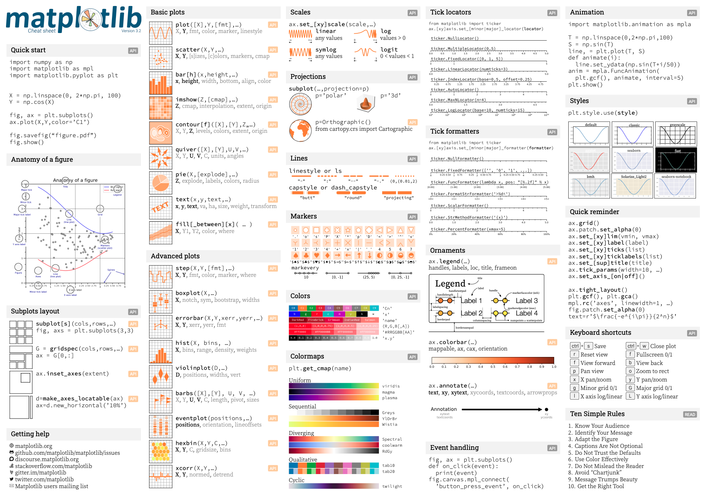
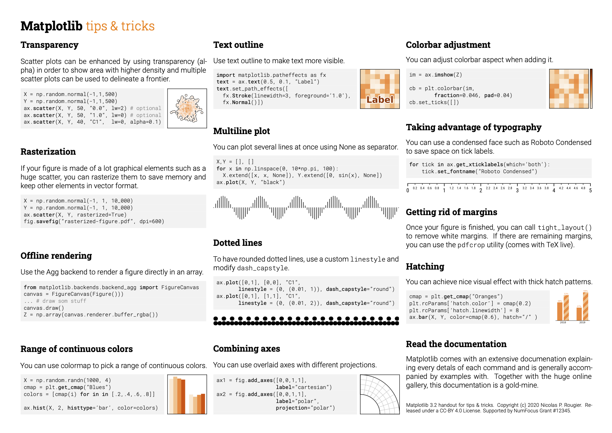

# ubuntu common instruction
[matplotlib](https://github.com/matplotlib/cheatsheets)

## docker

sudo su
docker ps -a
docker run ：创建一个新的容器并运行一个命令
语法
docker run [OPTIONS] IMAGE [COMMAND] [ARG...]
OPTIONS说明：

* -a stdin: 指定标准输入输出内容类型，可选 STDIN/STDOUT/STDERR 三项；

* -d: 后台运行容器，并返回容器ID；

* -i: 以交互模式运行容器，通常与 -t 同时使用；

* -P: 随机端口映射，容器内部端口随机映射到主机的端口

* -p: 指定端口映射，格式为：主机(宿主)端口:容器端口

* -t: 为容器重新分配一个伪输入终端，通常与 -i 同时使用；

* --name="nginx-lb": 为容器指定一个名称；

* --dns 8.8.8.8: 指定容器使用的DNS服务器，默认和宿主一致；

* --dns-search example.com: 指定容器DNS搜索域名，默认和宿主一致；

* -h "mars": 指定容器的hostname；

* -e username="ritchie": 设置环境变量；

* --env-file=[]: 从指定文件读入环境变量；

* --cpuset="0-2" or --cpuset="0,1,2": 绑定容器到指定CPU运行；

* -m :设置容器使用内存最大值；

* --net="bridge": 指定容器的网络连接类型，支持 bridge/host/none/container: 四种类型；

* --link=[]: 添加链接到另一个容器；

* --expose=[]: 开放一个端口或一组端口；

* --volume , -v: 绑定一个卷

nvidia-docker run -it --name=test_ynh --rm \
-v /mnt/data3:/mnt/data3 \
-v /mnt/data4:/mnt/data4 \
opencv:3.3.0 \
/bin/bash

docker commit test_ynh opencv:3.3.1

docker images

